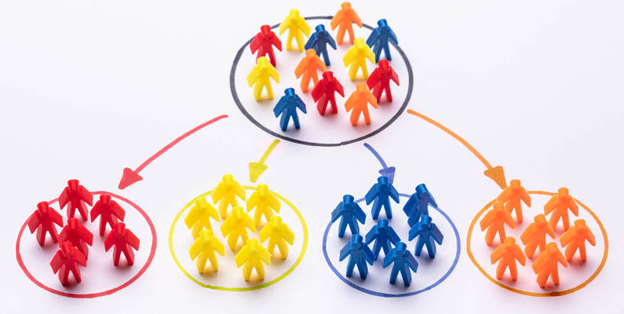

# 🧑🏻‍🤝‍🧑🏽💁🤝📊Customer Segmentation Analysis Using Clustering📈🕵️🔎🔢

## Overview 🔍
This project leverages clustering techniques to segment customers based on various attributes such as demographics, purchasing behavior, and response to marketing campaigns. By identifying distinct customer segments, businesses can develop targeted marketing strategies that resonate with each group's unique characteristics and needs. The analysis provides actionable insights and tailored marketing strategies for each identified segment.

## Dataset 🗂️

The dataset used can be found on Kaggle [here](https://www.kaggle.com/datasets/vishakhdapat/customer-segmentation-clustering).

## Tools Used 🛠️

  
  
  
  
  
  
  
  

- **Pandas:** Data manipulation and analysis.
- **Seaborn:** Statistical data visualization.
- **Matplotlib:** Plotting library for Python.
- **Scikit_learn:** Machine learning library for Python.
- **numpy:** Fundamental package for scientific computing with Python.

## Project Workflow 🎯
1. **Data Preprocessing:**
   - Numerical features are scaled using `StandardScaler`.
   - Categorical features are one-hot and label encoded using `OneHotEncoder`, `LabelEncoder`.
   - Impute missing values using `SimpleImputer`.
   - Convert `Dt_Customer` to datetime and calculate `Days_since_joining`.

2. **Clustering:**
   - Determine the optimal number of clusters using the Elbow method.
   - Train the K-means model with the optimal number of clusters.
   - Reduce dimensions using PCA for visualization.
   - Visualize the clusters using scatter plots.

3. **Cluster Analysis:**
   - Analyze the cluster profiles and identify key characteristics.
   - Develop targeted marketing strategies based on cluster insights.

## Findings✨🕵
- **Cluster 0**: Lower income, more children at home, lower spending on wines and fruits, lower campaign response.
- **Cluster 1**: Higher income, fewer children at home, higher spending on wines and fruits, higher campaign response.

### Implications for Marketing📢📌:
- **Cluster 0**: Target with affordable and family-oriented products. Focus on improving campaign engagement.
- **Cluster 1**: Target with premium products and personalized offers. Enhance loyalty programs to strengthen engagement.

## 👩‍💻 Author

- GitHub: [@rania3103](https://github.com/rania3103)
- LinkedIn: [LinkedIn](https://linkedin.com/in/rania-abassi-24105a249)

